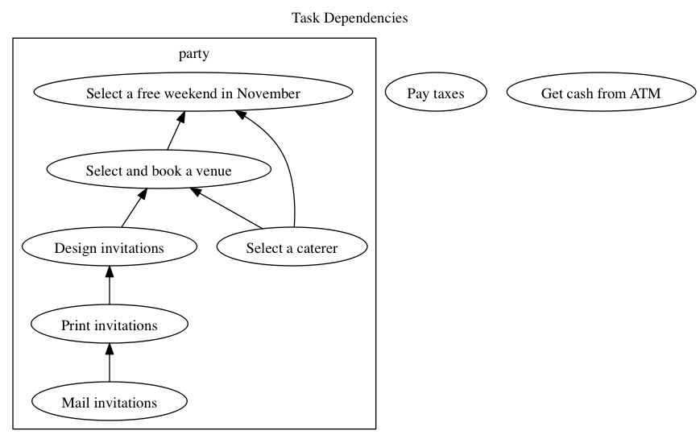

# TaskWarrior Dependency Visualization

Visualizes dependencies between TaskWarrior tasks.

## Example Output

## Installation

    $ gem install twdeps

## Usage

    # Create a dependency graph as PNG and pipe it to a file
    # See [Limitations](Limitations) below for why we need the extra task parms
    task export rc.json.array=on rc.verbose=nothing | twdeps > deps.png
  
    # Same but spefify output format
    task export | twdeps --format svg > deps.svg

    # Create a graph from a previously exported file
    task export > tasks.json
    cat tasks.json | twdeps > deps.png
  
    # Display graph in browser without creating an intermediate file
    # Requires bcat to be installed
    task export | twdeps --format svg | bcat

## Dependencies

The graph is generated with [ruby-graphwiz](https://github.com/glejeune/Ruby-Graphviz), which in turn requires a local [Graphviz](http://graphviz.org/) installation (e.g. `brew install graphviz`).

[bcat](http://rtomayko.github.com/bcat/) is required for piping into a browser.

## Limitations

Due to [two](http://taskwarrior.org/issues/1017) [bugs](http://taskwarrior.org/issues/1013) in JSON export, TaskWarrior 2.0 needs the command line options `rc.json.array=on` and `rc.verbose=nothing`.

## Contributing

1. Fork it
2. Create your feature branch (`git checkout -b my-new-feature`)
3. Commit your changes (`git commit -am 'Added some feature'`)
4. Push to the branch (`git push origin my-new-feature`)
5. Create new Pull Request
